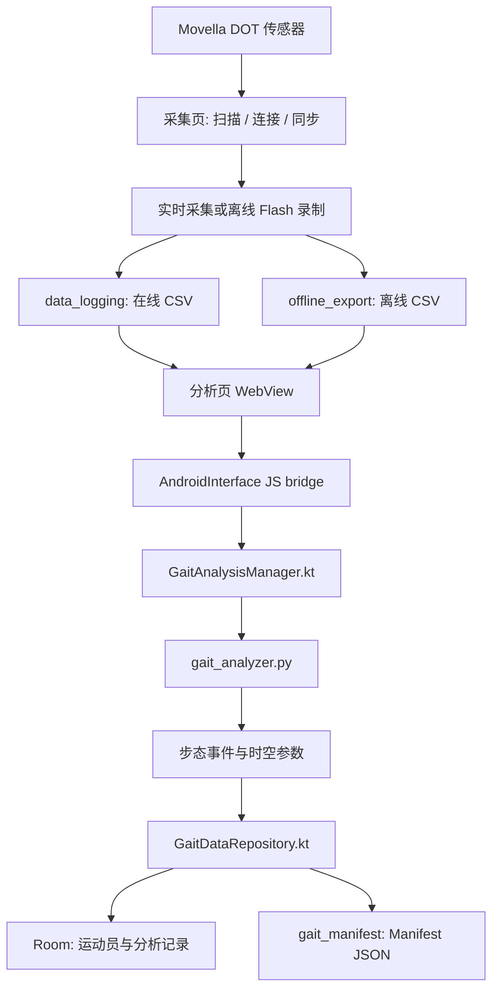

# MovellaDot Gait Toolkit

这是 `MovellaDot-Gait-Toolkit` 的唯一项目文档。它同时用于开发沟通和 Lovable UI 沟通。

项目基于 Android 与 Movella DOT 惯性传感器，目标是做一个跳远助跑步态采集与分析 App。当前最终产品是一个宿主 APK：`android-gait-dashboard`，内部包含 `采集` 和 `分析` 两个工作区。

## 1. 当前产品形态

最终产品：

```text
android-gait-dashboard
```

产品名固定为：

```text
跳远助跑步态分析系统
```

宿主 App 内部有两个一级工作区：

| 工作区 | 技术形态 | 作用 |
|---|---|---|
| `采集` | Compose 原生页面 | 连接 DOT 设备，同步，实时/离线采集，导出 CSV |
| `分析` | WebView 页面 | 选择 CSV，绑定运动员，调用 Python 分析，保存 manifest JSON |

`android-xsens-dot` 不再作为最终用户必须安装的第二个 APK。它保留为 DOT 采集能力来源和独立调试工程。

## 2. Lovable 沟通简报

这一节可以直接复制给 Lovable，用来说明 UI 方向。

### 产品一句话

这是一个面向跳远助跑训练的 IMU 采集与步态分析 App。用户在 Android 平板上连接 Movella DOT 传感器，完成离线或实时采集，再绑定运动员和试跳编号，计算步态参数并生成可上传的 manifest JSON。

### 目标用户

- 教练、科研人员、测试人员。
- 使用场景是训练场或实验现场，不是展示大屏。
- 第一诉求是状态清楚、操作直接、误操作少、文件能稳定导出。

### 视觉方向

采用深色仪器面板风格：

| Token | 用途 |
|---|---|
| `bg` | 页面底色 |
| `surface` | 顶部栏、底部栏、大背景面 |
| `card` | 功能卡片 |
| `border` | 细边框 |
| `text` | 主文字 |
| `muted` | 次级说明、标签 |
| `green` | 已就绪、成功、可执行 |
| `orange` | 注意、等待、超距 |
| `accent` | 当前选中、主交互 |
| `red` | 停止、清除、危险动作 |

组件语法：

- 页面是高密度工作台，不做营销页，不做大屏驾驶舱。
- 卡片圆角控制在 8-12，细边框，少阴影或无阴影。
- 按钮分三类：主按钮、次按钮、危险按钮。
- 状态使用 chip/badge，不用大段说明文字。
- 交互文案要短，避免“请靠拢”“官方已禁用”这类解释性句子。
- 采集页和分析页必须像同一个产品，不要一边像原生 App、一边像网页后台。

### 顶层结构

宿主 App 只能有一层产品级头部：

- 左侧保留 logo 和机构名。
- 产品名显示 `跳远助跑步态分析系统`。
- 底部一级导航固定为 `采集` / `分析`。
- 分析页嵌入 WebView 后不能再出现第二套完整品牌头。

### 采集页需要表达的工作流

采集页要做成直接的操作面板，推荐顺序：

1. 连接设备：扫描、连接、断开。
2. 同步设备：显示同步状态和每个 IMU 状态。
3. 选择采集模式：`离线采集` / `实时采集`。
4. 设置采样参数：离线模式允许 120Hz，实时模式不展示或不允许选择 120Hz。
5. 开始录制、停止录制。
6. 离线文件导出：按设备展开/折叠文件，选择后导出。

每个 IMU 都要能看到状态。离线录制时要特别注意 Movella SDK 状态：

| SDK/业务状态 | UI 建议 |
|---|---|
| 可录制 | `已就绪` |
| in progress | `录制中` |
| 录制中断开连接 | `超距` |
| 回到范围并恢复 in progress | 仍显示 `录制中`，此时再停止更稳 |
| 初始化或读取中 | `初始化` / `读取中` |

离线录制过程中如果蓝牙断开，App 需要用设备连接状态显示 `超距`；设备回到蓝牙范围后重新连接，并通过 SDK 查询到 `onRecording`，再结束录制才能更可靠地闭合设备端文件。这个状态必须在设备级别表达，不能只在页面顶部给一个总状态。

离线文件导出不要做成长列表堆叠。推荐：

- 每个设备一张折叠卡。
- 默认折叠，只显示设备名、文件数、状态。
- 展开后展示该设备文件列表。
- 可以选择文件、全选当前设备、清空选择、导出所选。
- 按钮文案不要叫“文件刷新”，可以叫 `读取文件` 或 `读取列表`。

### 分析页需要表达的工作流

分析页仍然是 WebView，不迁移到 Compose。Lovable 只需要给视觉和交互结构建议，不要改变接口。

主流程：

1. 新建或导入运动员名单。
2. 从下拉框选择运动员。
3. 自动生成或手动输入试跳编号，例如 `R001`。
4. 选择 CSV 来源：`上传 CSV`、`离线文件`、`在线文件`。
5. 点击 `计算`。
6. 显示图表、汇总指标、步态数据表。
7. 自动保存 manifest JSON。
8. 记录页按运动员查看历史。

当前分析页内部二级视图是：

| 当前标签 | 功能 |
|---|---|
| `分析结果` | 运动员、试跳、文件选择、计算、图表、汇总表 |
| `阶段分析` | 指标分布和阶段趋势 |
| `分析参数` | 时间范围、运动专项、起跳步、重新计算 |
| `记录` | 按运动员查看本地分析历史 |

这些名称可以继续优化，但必须保留四个功能区的结构。不要改 DOM id、JS 方法名、Android bridge 接口签名。

运动员信息已经进入本地数据库：

- 用户可以新建运动员。
- 用户可以导入 `longjump-athletes/v1` JSON 名单。
- 身高、体重、惯用腿来自运动员信息。
- 文件选择区不需要再单独输入身高体重。
- 起跳发力脚不再让用户单独输入，优先使用运动员 `extra.dominant_leg`。
- 记录页应按运动员分组或下拉筛选，不应该把所有记录无序铺开。

### Lovable 可以设计什么

- 采集页整体布局、状态层级、设备卡、采集控制区、离线导出折叠列表。
- 分析页 WebView 内部布局、运动员面板、文件选择面板、图表区、指标区、记录区。
- 统一颜色、边框、圆角、按钮、chip、输入框、下拉框、弹窗。
- 平板竖屏和手机竖屏的响应式排布。

### Lovable 不要改什么

- 不改 BLE 扫描、连接、同步、录制、离线导出 SDK 调用顺序。
- 不改 `offline_export`、`data_logging`、`gait_manifest` 三个路径。
- 不改 Python 分析算法。
- 不改 `analyzeGait`、`analyzeGaitContent`、文件枚举、运动员和 manifest 的 JS bridge contract。
- 不把分析页重写成 React 业务实现。React 原型只作为视觉参考，最终仍要翻译回 Android Compose + WebView HTML/CSS。

## 3. 工程模块

| 路径 | 角色 | 说明 |
|---|---|---|
| `android-gait-dashboard/` | 最终宿主 App | 统一壳、采集页、分析页、运动员库、manifest 导出 |
| `android-xsens-dot/` | 采集代码来源 | BLE、DOT SDK、同步、实时采集、离线 Flash 录制 |
| `SDK for Android v2025_1_1/` | SDK 文件 | Movella DOT SDK AAR 备份 |
| `legacy/` | 历史归档 | 旧版 XMDS 快照，不做新功能 |
| `lovable-project-bb952882/` | UI 参考 | Lovable React 原型，只参考视觉方向 |
| `device_exports/` | 本机导出结果 | adb 拉取的 JSON/CSV/zip，属于运行产物，不是源码模块 |

## 4. 运行时数据流



## 5. 宿主 App: `android-gait-dashboard`

### 职责

- 生成最终 APK。
- 申请 BLE、通知、文件访问等权限。
- 初始化 Movella DOT SDK。
- 启动 BLE 前台服务。
- 承载 `采集 / 分析` 两个工作区。
- 管理 WebView 分析页和 JS bridge。
- 管理 Room 本地运动员库。
- 保存 manifest JSON。

### 关键文件

| 文件 | 作用 |
|---|---|
| `app/src/main/java/com/buct/xsens/gait/MainActivity.kt` | 主 Activity、权限、顶部栏、底部导航、采集/分析切换 |
| `app/src/main/java/com/buct/xsens/gait/GaitDashboardApp.kt` | Application，初始化 DOT SDK |
| `app/src/main/java/com/buct/xsens/gait/ui/screens/GaitDashboardScreen.kt` | WebView 容器和 `AndroidInterface` |
| `app/src/main/java/com/buct/xsens/gait/engine/GaitAnalysisManager.kt` | Kotlin 调 Python 的桥接层 |
| `app/src/main/java/com/buct/xsens/gait/data/GaitDatabase.kt` | Room Entity、DAO、Database |
| `app/src/main/java/com/buct/xsens/gait/data/GaitDataRepository.kt` | 运动员 JSON、试跳编号、manifest 生成 |
| `app/src/main/assets/gait_dashboard/index.html` | 分析页 UI 和前端逻辑 |
| `app/src/main/python/gait_analyzer.py` | 步态分析算法入口 |

### 采集代码接入方式

宿主工程通过 `sourceSets` 引入 `android-xsens-dot` 的采集代码：

```gradle
sourceSets {
    main {
        java.srcDirs += '../../android-xsens-dot/app/src/main/java'
    }
}
```

最终 APK 仍然只从 `android-gait-dashboard` 构建。

## 6. 采集模块

采集代码路径：

```text
android-xsens-dot/app/src/main/java/com/buct/xsens/dot/
```

`android-xsens-dot` 是 Movella DOT 采集能力的来源工程。它仍可单独编译安装，用于排查 DOT SDK、BLE 连接、同步和离线 Flash 导出问题，但不是最终发布 App。

### 功能

- BLE 扫描和连接。
- 多 DOT 设备连接管理。
- SDK 多设备同步。
- 实时测量和 CSV 写盘。
- 离线 Flash 录制。
- 设备端录制文件列表读取。
- 按设备展开/折叠文件列表并导出。
- 录制过程状态提示，包括 `录制中`、`超距`、回连后停止。

### 关键文件

| 文件 | 作用 |
|---|---|
| `engine/DotBleScanner.kt` | BLE 扫描 |
| `engine/CollectionEngine.kt` | 连接、测量、同步、采样率、滤波配置 |
| `engine/RecordingEngine.kt` | 离线 Flash 录制、文件列表、导出、时间锚点 |
| `service/BleStreamingService.kt` | BLE 前台服务 |
| `viewmodel/CollectionViewModel.kt` | 采集页状态和操作入口 |
| `data/CsvRecorder.kt` | 在线实时 CSV 写盘 |
| `data/SensorData.kt` | 传感器数据模型 |
| `ui/screens/MainScreen.kt` | 采集主页面 |
| `ui/screens/SensorCards.kt` | 传感器状态和数据展示 |
| `ui/components/CommonComponents.kt` | 面板、按钮、状态组件 |
| `ui/theme/Theme.kt` | 深色仪器面板主题 |

### 在线采集 CSV

路径：

```text
/sdcard/Documents/XsensData/data_logging/
```

典型列：

```text
PacketCounter,SampleTimeFine,roll,pitch,yaw,freeAccX,freeAccY,freeAccZ,gyroX,gyroY,gyroZ
```

### 离线 Flash CSV

路径：

```text
/sdcard/Documents/XsensData/offline_export/
```

文件头部保留两个手机本地时间锚点：

```text
record_start_command_utc_ms,<发送开始录制命令时的手机 UTC 毫秒>
record_start_ack_utc_ms,<收到开始录制 ACK 时的手机 UTC 毫秒>

PacketCounter,SampleTimeFine,...
```

注意：

- `SampleTimeFine` 是传感器内部采样时间，适合多 IMU 相对对齐。
- `PacketCounter` 用于连续性检查、采样间隔计算和对侧脚配对分析。
- `record_start_command_utc_ms` 和 `record_start_ack_utc_ms` 是手机本地时间锚点，不是硬件 UTC 授时。
- 当前写盘固定到公共 Documents 路径；Android 11 及以上缺少所有文件访问权限时会报错，不再静默写到 App 私有目录。
- 离线录制过程中设备蓝牙断开时，App 根据连接状态显示 `超距`；设备回到范围后重新连接，并通过 SDK 查询到 `onRecording`，再停止录制更稳。

## 7. 分析 WebView 模块

入口文件：

```text
android-gait-dashboard/app/src/main/assets/gait_dashboard/index.html
```

宿主加载 URL：

```text
file:///android_asset/gait_dashboard/index.html?embedded=1
```

`embedded=1` 只影响页面嵌入样式，不改变分析接口和文件读取逻辑。

### 页面分区

| 标签 | 功能 |
|---|---|
| `分析结果` | 运动员、试跳、文件选择、计算、图表、汇总表 |
| `阶段分析` | 指标分布和阶段趋势 |
| `分析参数` | 时间范围、运动专项、起跳步、重新计算 |
| `记录` | 按运动员查看本地分析历史 |

### JS bridge

`GaitDashboardScreen.kt` 暴露 `AndroidInterface` 给 WebView。

| 接口 | 作用 |
|---|---|
| `isStorageManagerGranted()` | 检查所有文件访问权限 |
| `openStorageSettings()` | 打开系统权限设置 |
| `diagOfflinePaths()` | 诊断离线目录 |
| `getOfflineFileList()` | 读取 `offline_export` |
| `getOnlineFileList()` | 读取 `data_logging` |
| `getFileList()` | 兼容旧接口，合并在线/离线 CSV |
| `analyzeGait(...)` | 按文件路径分析 CSV |
| `analyzeGaitContent(...)` | 按上传内容分析 CSV |
| `getAthletesJson()` | 读取本地运动员列表 |
| `importAthletesJson(content)` | 导入运动员 JSON 名单 |
| `saveAthleteJson(content)` | 新建或编辑运动员 |
| `getNextAttemptNo(athleteId)` | 生成试跳编号 |
| `saveImuManifest(...)` | 保存 manifest JSON |

## 8. Python 分析模块

入口：

```text
android-gait-dashboard/app/src/main/python/gait_analyzer.py
```

Kotlin 调用：

```text
GaitAnalysisManager.analyzeGait(...)
```

Python 主函数：

```text
process_gait_data(...)
```

### 输出能力

- 自动识别在线/离线 CSV 格式。
- 找到包含 `PacketCounter` 或 `SampleTimeFine` 的真实表头行。
- 估计采样率。
- 检测 IC、TC、MS、MSW 等步态事件。
- 计算步频、步速、步幅、步态周期时间、触地时间、双足支撑时间、腾空时间、摆动时间、vGRF 峰值。
- 支持跳远/三级跳参数。
- 自动查找同试跳对侧脚 CSV，输出 `contra_data`。

### 左右脚约定

| 设备号特征 | 默认侧别 |
|---|---|
| `D422CD007E6E` | 左脚 `L` |
| `D422CD00937F` | 右脚 `R` |

如果同目录下存在同一试跳的对侧 CSV，manifest 会输出：

```text
imu_raw_timeseries
gait_metrics_left
gait_metrics_right
```

如果对侧 CSV 不存在或匹配失败，则退回单脚输出。

## 9. 本地运动员数据库

数据库：

```text
longjump_gait.db
```

定义文件：

```text
android-gait-dashboard/app/src/main/java/com/buct/xsens/gait/data/GaitDatabase.kt
```

### 表结构

| 表 | Entity | 作用 |
|---|---|---|
| `athletes` | `AthleteEntity` | 运动员信息 |
| `organizations` | `OrganizationEntity` | 机构信息 |
| `analysis_records` | `AnalysisRecordEntity` | 分析记录和 manifest 路径 |

### 运动员 JSON

导入 schema：

```text
longjump-athletes/v1
```

字段：

```text
athlete_id
athlete_code
name
gender
birth_date
height_cm
weight_kg
group_name
extra
```

`extra` 用于保留惯用腿、最好成绩、备注等扩展字段。当前 UI 已支持新建、编辑、导入名单和选择运动员；同一个 `athlete_id` 再导入会更新，不重复插入。

## 10. Manifest JSON

保存路径：

```text
/sdcard/Documents/XsensData/gait_manifest/
```

文件名：

```text
yyyyMMdd_HHmmss_imu_manifest_{athlete_id}_{attempt_no}.json
```

schema：

```text
longjump-data-manifest/v1
```

### 记录结构

每次分析至少保存：

```text
imu_raw_timeseries
gait_metrics_left 或 gait_metrics_right
```

如果同一试跳能匹配到对侧脚 CSV，则保存：

```text
imu_raw_timeseries
gait_metrics_left
gait_metrics_right
```

### 指标映射

| Python 字段 | Manifest 字段 |
|---|---|
| `to_timestamp_ms` | `to_timestamp` |
| `stride_velocity_mps` | `average_velocity_mps` |
| `stride_length_m` | `stride_length_m` |
| `step_frequency_hz * 60` | `step_frequency_spm` |
| `stride_time_s` | `stride_time_s` |
| `contact_time_s` | `contact_time_s` |
| `double_support_time_s` | `double_support_time_s` |
| `flight_time_s` | `flight_time_s` |
| `swing_time_s` | `swing_time_s` |
| `vGRF_peak_BW` | `vgrf_peak_bw` |

### 上传包建议

对外系统上传时，建议按单次试跳组织为一个包，避免后续在多个目录里找文件：

```text
trial_package/
├── yyyyMMdd_HHmmss_imu_manifest_{athlete_id}_{attempt_no}.json
├── D422CD007E6E_yyyyMMdd_HHmmss.csv
└── D422CD00937F_yyyyMMdd_HHmmss.csv
```

当前 App 已能保存 manifest；正式上传功能后续应在 App 内生成 zip。

## 11. 权限和设备路径

Android 11 及以上需要 `MANAGE_EXTERNAL_STORAGE`，否则无法稳定写入和读取公共 Documents 下的采集文件。

| 数据类型 | 设备路径 |
|---|---|
| 在线实时 CSV | `/sdcard/Documents/XsensData/data_logging/` |
| 离线 Flash CSV | `/sdcard/Documents/XsensData/offline_export/` |
| Manifest JSON | `/sdcard/Documents/XsensData/gait_manifest/` |

分析页的 `离线文件` 和 `在线文件` 按钮分别读取 `offline_export` 和 `data_logging`。这两个路径是采集和分析之间的 contract，不要为了 UI 设计改路径。

拉取示例：

```bash
adb pull /sdcard/Documents/XsensData/gait_manifest ./device_exports/gait_manifest
adb pull /sdcard/Documents/XsensData/offline_export ./device_exports/offline_export
adb pull /sdcard/Documents/XsensData/data_logging ./device_exports/data_logging
```

## 12. 开发边界

| 要改什么 | 优先改哪里 |
|---|---|
| 宿主导航、权限、采集/分析切换 | `android-gait-dashboard/app/src/main/java/com/buct/xsens/gait/MainActivity.kt` |
| 采集 BLE / 同步 / 离线导出 | `android-xsens-dot/app/src/main/java/com/buct/xsens/dot/` |
| 分析页面 UI | `android-gait-dashboard/app/src/main/assets/gait_dashboard/index.html` |
| Python 分析算法 | `android-gait-dashboard/app/src/main/python/gait_analyzer.py` |
| 运动员库 / manifest contract | `GaitDatabase.kt`、`GaitDataRepository.kt` |
| SDK 版本 | `android-xsens-dot/app/libs/` 和 `android-gait-dashboard/app/build.gradle` |

不要在 `legacy/` 做新功能，不要让 App 源码依赖 `device_exports/` 或 Lovable 原型目录。

## 13. 构建和安装

最终宿主 APK：

```bash
cd android-gait-dashboard
./gradlew assembleDebug
```

安装到已连接设备：

```bash
adb install -r app/build/outputs/apk/debug/app-debug.apk
```

独立采集参考工程只在需要单独调 DOT 采集链路时使用：

```bash
cd android-xsens-dot
./gradlew assembleDebug
```

如果使用采集参考工程自带脚本：

```bash
cd android-xsens-dot
./build.sh
./install.sh
```

## 14. SDK

当前使用 Movella DOT SDK v2025.1.1。最终宿主 APK 依赖：

```text
android-xsens-dot/app/libs/Movella_DOT_SDK_Core_Android_v2025.1.1-release.aar
```

上级目录还保留 SDK AAR 备份：

```text
SDK for Android v2025_1_1/
```

更新 SDK 时需要同时检查：

- `android-xsens-dot/app/libs/`
- `android-gait-dashboard/app/build.gradle`
- `android-gait-dashboard/app/src/main/java/com/buct/xsens/gait/GaitDashboardApp.kt`
